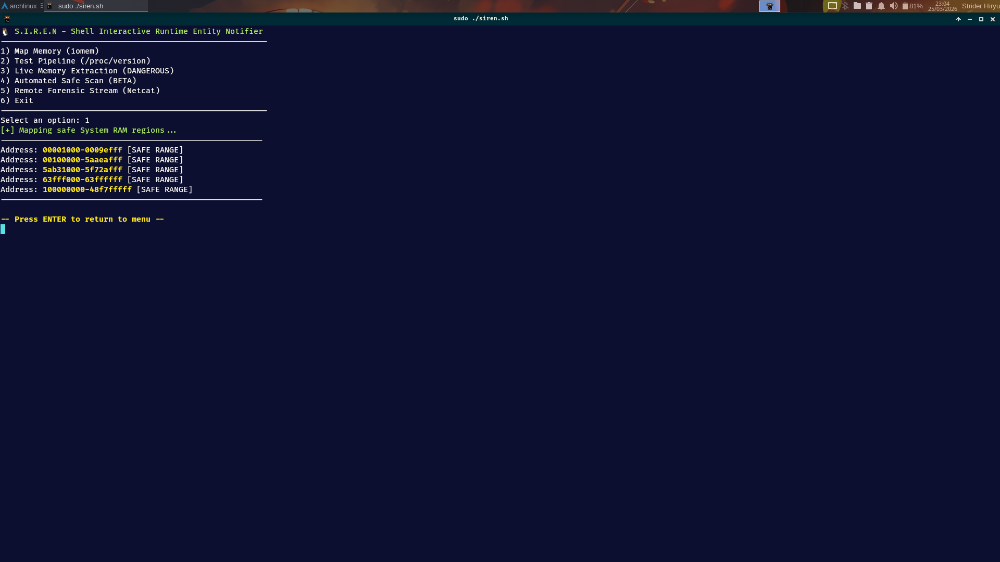
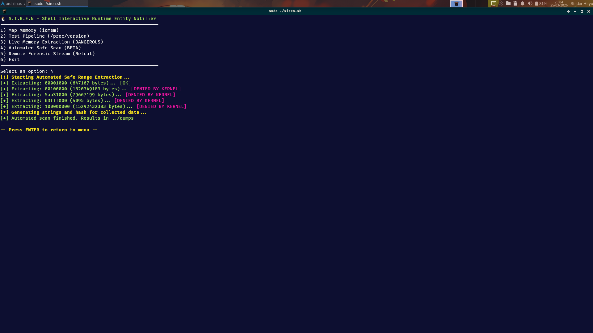
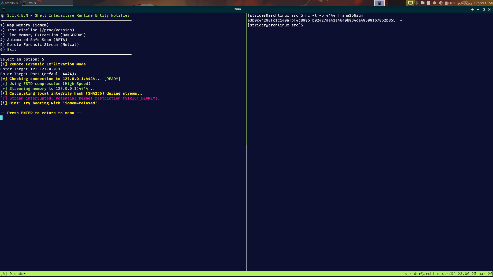

# S.I.R.E.N

Linux memory acquisition tool with audit-aware forensic triage.


[](https://kernel.org)
[](https://www.gnu.org/software/bash/)
[](LICENSE)
[](#-roadmap)
[](https://github.com/jeffersoncesarantunes/S.I.R.E.N/actions/workflows/shellcheck.yml)
[](https://github.com/jeffersoncesarantunes/S.I.R.E.N/actions/workflows/codeql.yml)
[](Dockerfile)
[](https://security.archlinux.org/)
[](./docs/SAFETY_MODEL.md)


---

## Etymology & Origin

**S.I.R.E.N** stands for **S**hell **I**nteractive **R**untime **E**ntity **N**otifier. It's a runtime memory acquisition tool for live forensic triage on Linux systems.


---

## Overview

S.I.R.E.N performs **audit-aware acquisitions** by reading LinSpec's `report.json` and adapting its extraction strategy based on kernel hardening levels. It supports both interactive and headless (CLI) operation.

**Core Capabilities:**


* **Audit-Aware Acquisition:** Reads LinSpec reports (`report.json`) to select the best extraction strategy
* **Safe Memory Mapping:** Parses `/proc/iomem` for valid System RAM regions
* **Adaptive Source Selection:** Prefers `/proc/kcore` with ELF-aware extraction or LiME for physical RAM (falls back to dd if needed)
* **Content Validation:** Post-dump entropy sampling and size verification
* **Forensic Artifacts:** SHA256 hashes, strings, JSON reports, CSV manifest, ELF segment metadata


---

## Features


* ELF-aware `/proc/kcore` extraction via Python (PT_LOAD segments)
* LiME physical memory acquisition as optional backend (kernel module)
* SHA256 integrity verification
* JSON forensic reports with audit parameters
* CSV manifest logging
* On-demand string extraction
* Pre-acquisition disk space validation
* Safe-range mapping via `/proc/iomem`
* Interactive menu and non-interactive CLI (`--quick`, `--full`, `--lime`, `--test`)
* Persistent operation log for chain of custody
* Automatic fallback: LiME → kcore → dd
* Automated Volatility profile matching (v2 and v3) with JSON report integration


---

## Example Output

```bash
# SIREN Output: Mapping System RAM
[+] Mapping Physical System RAM regions...

--> Address: 00001000-0009efff : System RAM [VALID]
--> Address: 00100000-5aaeafff : System RAM [VALID]
```


---

## How It Works

S.I.R.E.N talks to three acquisition sources:


* `/proc/iomem` -- memory layout classification
* `/proc/kcore` -- ELF-format kernel virtual address space
* LiME kernel module -- physical RAM via `/dev/lime` (optional backend)

Here's the acquisition flow:


1. Load LinSpec audit data (`report.json`) via Python3
2. Walk through `/proc/iomem` to map valid System RAM regions
3. Select backend: LiME (if module available) → ELF-aware kcore → dd fallback
4. Validate dump content (non-null sample, minimum size)
5. Generate forensic artifacts (hashes, strings, JSON, CSV, segment metadata)


### Acquisition sources

**`/proc/kcore`** exports the kernel virtual address space as an ELF core dump, not raw physical RAM. Suitable for string extraction, hashing, hexdump, and YARA scanning.

**LiME** (Linux Memory Extractor) captures physical RAM via a loadable kernel module, producing dumps compatible with Volatility and other forensic frameworks. SIREN uses LiME as an optional backend — if the module is found it is loaded, memory is read via `/dev/lime`, and the module is unloaded automatically. Falls back to `/proc/kcore` if LiME is unavailable.


---

## Quick Start

```bash
git clone https://github.com/jeffersoncesarantunes/S.I.R.E.N.git
cd SIREN
chmod +x src/siren.sh tools/kcore_extract.py
sudo ./src/siren.sh
```

> S.I.R.E.N is a Bash/Python tool — no compilation required.

## Usage

### Interactive mode

```bash
sudo ./src/siren.sh
```

### Non-interactive (CLI) mode

```bash
sudo ./src/siren.sh --quick                                  # Quick triage: first 100MB of /proc/kcore
sudo ./src/siren.sh --full                                   # Full acquisition: ELF-aware extraction
sudo ./src/siren.sh --lime                                   # LiME physical RAM acquisition
sudo LIME_MODULE=/path/to/lime.ko ./src/siren.sh --lime      # LiME with explicit module path
sudo ./src/siren.sh --test                                   # Test acquisition pipeline
sudo ./src/siren.sh --map                                    # Display System RAM map
sudo ./src/siren.sh --full --output /evidence/case-001/      # Custom output directory
```


---

## Investigation & Post-Acquisition Workflow

### 1. Integrity Verification

```bash
sha256sum -c dumps/checksums/*.sha256
```

### 2. Manual String Analysis (Optional)

```bash
strings dumps/binaries/*.bin | grep -Ei "pass|token|config|secret" | grep -v "/usr/" | head -n 50
```

### 3. Hexadecimal Inspection

```bash
hexdump -C dumps/binaries/*.bin | head -n 20
```

### 4. Segment Metadata

```bash
cat dumps/binaries/*.meta.json
```

### 5. Manifest Inspection

```bash
column -s, -t < dumps/reports/manifest.csv
```

### Generated Artifacts

Each run produces:


* Raw memory dump (`.bin`)
* ELF segment metadata (`.meta.json`, when using Python extraction)
* SHA256 checksum (`.sha256`)
* Extracted strings (`.txt`)
* JSON forensic report
* CSV manifest log
* Persistent operation log (`siren.log`)


---

## Why

Memory acquisition on Linux is a pain. Kernel protections get in the way, interfaces are inconsistent, and you never quite know what you're going to get.

S.I.R.E.N standardizes the process by combining audit-aware acquisition with adaptive extraction methods and built-in integrity validation.

**What S.I.R.E.N is NOT:**

* It is NOT a replacement for dedicated incident response frameworks like Velociraptor or GRR
* The dumps produced via kcore are kernel virtual address space, NOT raw physical RAM (use `--lime` for physical RAM)
* Not intended for court-admissible forensic acquisition without additional tooling


---

## Project in Action



*Detection of valid System RAM regions via `/proc/iomem`.*



*Controlled extraction and validation pipeline.*



*Full acquisition using `/proc/kcore` with integrity verification.*


---

## Operational Integrity

S.I.R.E.N was built for live-response work where you can't afford to mess things up:


* Read-only interaction with memory interfaces
* No kernel modification
* Minimal system interference
* Automatic evidence integrity validation
* Graceful failure on restricted access


---

## Deployment

### Requirements


* Linux OS with root privileges
* Bash 4.x+
* Python 3.x (recommended; falls back gracefully)
* `dd`, `sha256sum`, `strings`, `stat`, `insmod`/`rmmod`
* LiME kernel module (`lime.ko`) compiled for your kernel (optional; auto-falls back to kcore)
* Volatility 2 or 3 (optional; enables automated profile matching in reports)

  To compile LiME:
  ```bash
  git clone https://github.com/504ensicsLabs/LiME.git
  cd LiME/src
  make
  cp lime.ko /path/to/your/tools/
  ```

### Optional Tools

These tools enhance forensic analysis but are **not required** — SIREN continues normally if they are absent:

| Tool | Purpose | Arch Linux |
|------|---------|-----------|
| **Volatility 3** | Profile matching in JSON reports | `sudo pacman -S volatility` |
| **Volatility 2** | Legacy profile matching | `yay -S volatility-git` |
| **LiME** | Physical RAM acquisition | Compile from [source](https://github.com/504ensicsLabs/LiME) for your kernel version |

If Volatility is not installed or the dump format is incompatible, the profile field in `report.json` is left empty and acquisition proceeds normally — no pipeline interruption.


---

## Repository Structure

```text
├── docs/
│   ├── ACQUISITION_MODEL.md
│   ├── FORENSIC_WORKFLOW.md
│   └── SAFETY_MODEL.md
├── dumps/
├── Images/
│   ├── siren1.png
│   ├── siren2.png
│   └── siren3.png
├── lib/
│   ├── acquisition.sh
│   ├── audit.sh
│   ├── reporting.sh
│   └── safety.sh
├── src/
│   └── siren.sh
├── tools/
│   └── kcore_extract.py
├── .gitignore
├── LICENSE
├── SECURITY.md
└── README.md
```


---

## Tech Stack


* **Language:** Bash 4.x+ / Python 3.x (ELF parsing)
* **Data Sources:** `/proc/iomem`, `/proc/kcore`, `/dev/lime` (LiME)
* **Integration:** LinSpec (audit-aware parsing), LiME (physical RAM backend)
* **Core Utilities:** `dd`, `sha256sum`, `strings`, `python3`, `insmod`/`rmmod`
* **Forensic Tools:** Volatility 2/3 (optional, for profile matching)


---

## Roadmap


* [x] Safe-range extraction logic
* [x] ELF-aware /proc/kcore extraction (PT_LOAD segments)
* [x] JSON forensic reports with audit parameters
* [x] CSV manifest logging
* [x] LinSpec Integration (Adaptive Acquisition)
* [x] Content validation (entropy sampling, magic bytes)
* [x] Non-interactive CLI mode (`--quick`, `--full`, `--test`)
* [x] Persistent operation logging
* [x] LiME integration as optional backend
* [x] Automated Volatility profile matching
* [ ] Remote acquisition over SSH tunnel


---

## Documentation

[](./docs/ACQUISITION_MODEL.md)
[](./docs/FORENSIC_WORKFLOW.md)
[](./docs/SAFETY_MODEL.md)


