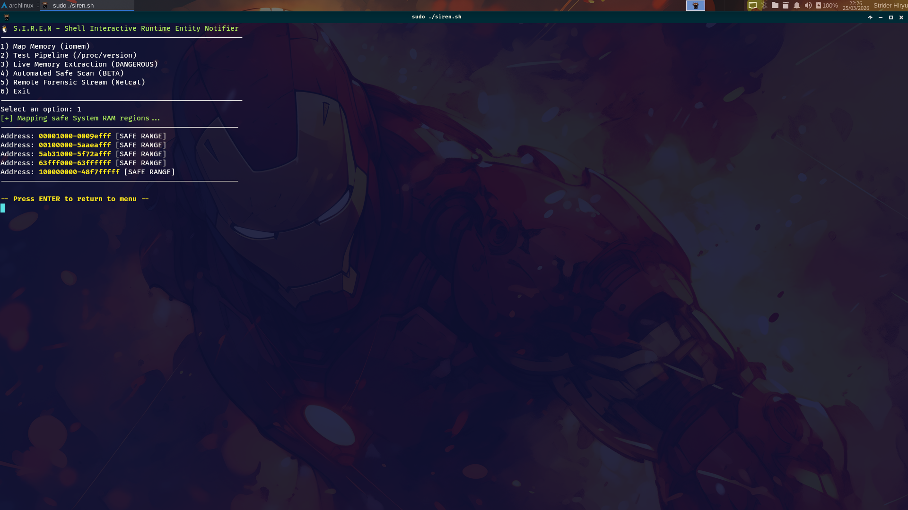
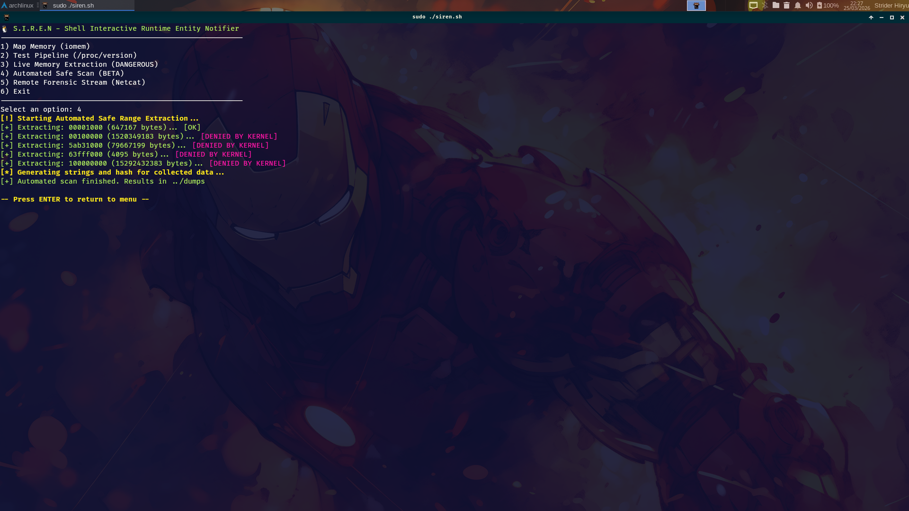
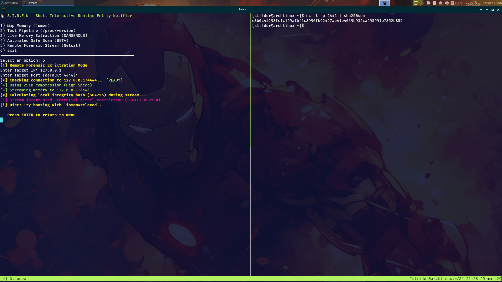

# 🐧 S.I.R.E.N

High-speed Linux memory forensics tool for live acquisition, streaming, and forensic triage.

[](https://kernel.org)
[](https://www.gnu.org/software/bash/)
[](LICENSE)


---

## ● Etymology & Origin

The name **S.I.R.E.N** is a recursive acronym that reflects the tool's dual nature: an alert system and a data harvester.

In forensic mythology, the Siren calls for the truth hidden within the depths. In this context, it symbolizes the systematic notification (Entity Notifier) of memory states during runtime. It acts as a digital beacon, ensuring that even as data is streamed (Runtime Entity), its integrity remains monitored and auditable, sounding the "alarm" if any hardware-reserved zone or kernel restriction is breached.

---

## ● Overview

S.I.R.E.N is a specialized forensic utility designed for high-speed memory acquisition and real-time integrity auditing.

**Core Capabilities:**
- **Zero-Footprint:** Live forensic exfiltration via network sockets.
- **Parallel Processing:** Calculates SHA256 hashes and extracts strings simultaneously.
- **Kernel Awareness:** Maps safe System RAM regions via `/proc/iomem`.

---

## ● How It Works

S.I.R.E.N interfaces with the Linux Kernel through the \`/proc/iomem\` interface and the \`/dev/mem\` character device.

The acquisition logic follows a non-destructive path:

1. **Memory Mapping:** Parses \`/proc/iomem\` to differentiate between System RAM and reserved hardware offsets  
2. **Streaming Pipeline:** Uses pipes to feed data into \`sha256sum\` and \`strings\` in parallel  
3. **Network Exfiltration:** Uses Netcat (\`nc\`) to stream raw memory blocks to a remote workstation  

All inspection is designed to minimize the forensic footprint on the target system.

---

## ● Example Output

```bash
# SIREN Output: Mapping System RAM
[+] Mapping safe System RAM regions...

[!] Starting acquisition from: /dev/mem
[+] Address: 00001000-0009fbff [SAFE RANGE]
[+] Address: 00100000-b697efff [SAFE RANGE]
[+] Pipeline completed successfully
```

---

## ● Project in Action

  
*1 - Detection of safe System RAM regions using /proc/iomem.*

  
*2 - Automated Safe Scan: Performing memory range extraction while respecting Kernel-level restrictions (e.g., CONFIG_STRICT_DEVMEM).*

  
*3 - Remote forensic memory streaming using Netcat with live SHA256 integrity verification.*

---

## ● Remote Forensic Streaming (Option 5)

This feature allows RAM extraction without writing large files to disk (Zero-Footprint approach).

### 1. On Forensic Workstation (Receiver)

```bash
# Using ZSTD (Recommended)
nc -l -p 4444 | zstd -d > remote_mem_dump.bin

# Using GZIP (Fallback)
nc -l -p 4444 | gunzip > remote_mem_dump.bin
```

### 2. On Target Machine

Select Option 5, enter the IP and Port. The script streams data while generating a local hash for verification.

---

## ● Critical Safety: ACTION REQUIRED

When performing Option 3 (Live Memory Extraction), the system accesses \`/dev/mem\`.

**IMPORTANT:** Selecting Option 3 triggers a mandatory confirmation. To prevent a system freeze, the user must acknowledge bypassing reserved memory ranges.

---

## ● Features

- Remote exfiltration via Netcat with connectivity validation
- Live SHA256 integrity auditing
- Real-time string extraction
- Pre-acquisition disk space verification
- \`/proc/iomem\` safe-range mapping
- Linux CONFIG_STRICT_DEVMEM restriction detection

---

## ● Operational Integrity

S.I.R.E.N is designed for forensic stability:

- Pre-flight network validation
- Read-only access to memory devices
- Parallel processing for performance
- No kernel or process modification
- Graceful failure on access denial

---

## ● Investigation Workflow

### 1. Integrity Verification

```bash
sha256sum -c dump_filename.sha256
```

### 2. Forensic String Search

```bash
grep -Ei "pass|user|config" mem_strings.txt
```

### 3. Hexadecimal Inspection

```bash
hexdump -C mem_dump.bin | head -n 20
```

---

## ● Deployment

### Requirements

- Linux OS with root privileges
- Netcat (for remote exfiltration)
- Bash 4.x+

---

## ● Execution

```bash
# 1. Clone & Enter the repository
git clone https://github.com/jeffersoncesarantunes/S.I.R.E.N.git
cd S.I.R.E.N

# 2. Setup
chmod +x src/siren.sh

# 3. Run (root privileges required)
sudo ./src/siren.sh
```

---

## ● Repository Structure

```text
├── docs/
├── dumps/
├── Imagens/
├── src/
│   └── siren.sh
├── .gitignore
├── LICENSE
└── README.md
```

---

## ● Troubleshooting: Kernel Restrictions

If the dump stops at exactly 1.0MB or shows [DENIED BY KERNEL], your system is protected by **CONFIG_STRICT_DEVMEM**.

To bypass (for forensic use only), add:

```bash
iomem=relaxed
```

to your boot parameters and reboot.

---

## ● Tech Stack

- **Language:** Bash
- **Data Source:** /dev/mem, /proc/iomem
- **Utilities:** dd, sha256sum, strings, nc

---

## ● Roadmap

- [x] Safe-range extraction
- [x] Network validation
- [x] Compression support (zstd/gzip)
- [ ] LiME integration
- [ ] JSON forensic reports

---

## ● Documentation

[](./docs/ACQUISITION_MODEL.md)
[](./docs/FORENSIC_WORKFLOW.md)
[](./docs/SAFETY_MODEL.md)

---

## ● License

[](./LICENSE)

*This project is licensed under the MIT License.*
